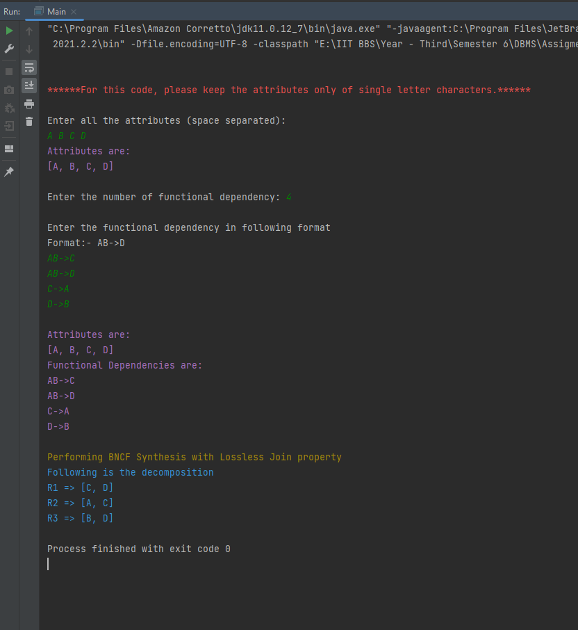
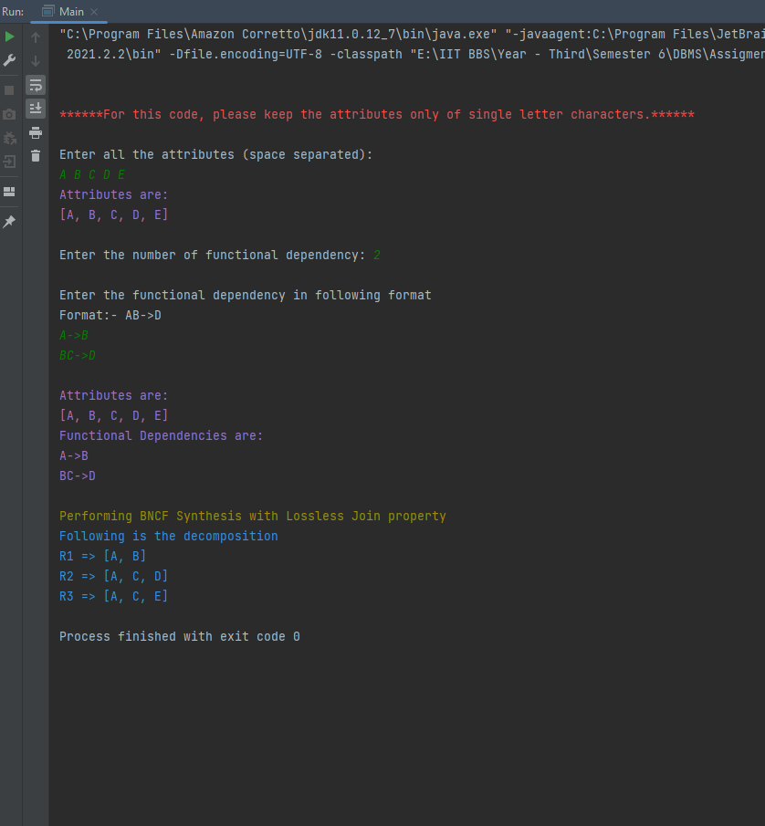
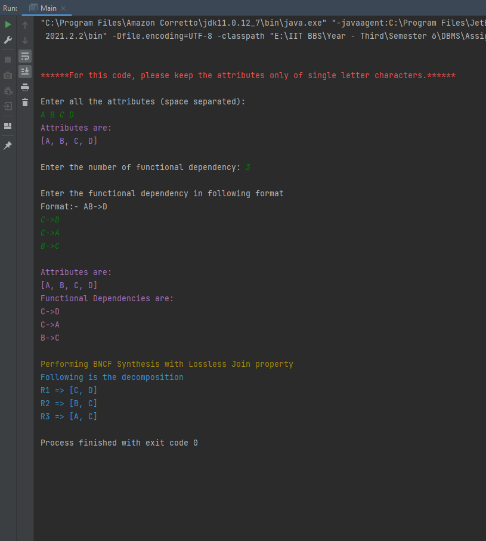

# BCNF Synthesis

----

## Algorithm:

**Input:** A universal relation R and a set of functional dependencies F on the attributes of R.

    1. Set D := {R};
    3. While there is a relation schema Q in D that is not in BCNF
        do {
            Choose a relation schema Q in D that is not in BCNF;
            Find a functional dependency X -> Y that violates BCNF;
            Replace Q in D by two relation schemas (Q - Y) and (X u Y);
        }
    Assumption: No null values are allowed for the join attributes.

## Input format for the given code:
1. Enter all the attributes of the given relation in space separated manner. For this code please adhere to single letter characters.
2. Enter the number of functional dependencies.
3. Enter the functional dependency in the format: AB->C, B->DEF, etc.

## Output format:
A relational decomposition showing BCNF synthesis.

## Screenshot of output:
1. Example - 1 
2. Example - 2 
3. Example - 3 